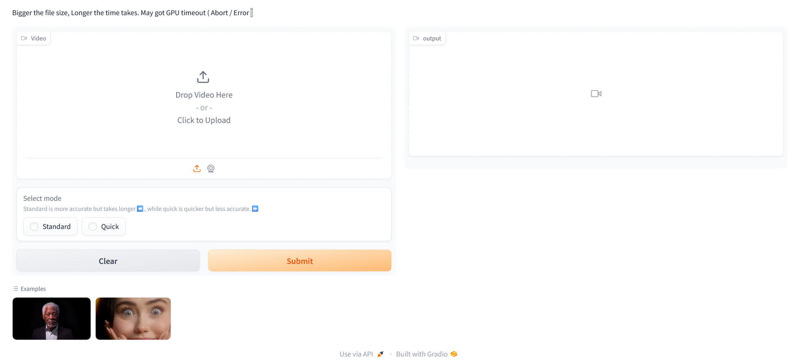

🚀Check out the configuration reference at https://huggingface.co/docs/hub/spaces-config-reference

🚀Huggingface Spaces : https://huggingface.co/spaces/prithivMLmods/Video-Background-Remover

🚀Docs for Space :

      # Make sure you have git-lfs installed (https://git-lfs.com)
      git lfs install
      
      git clone https://huggingface.co/spaces/prithivMLmods/Video-Background-Remover
      
      # If you want to clone without large files - just their pointers
      
      GIT_LFS_SKIP_SMUDGE=1 git clone https://huggingface.co/spaces/prithivMLmods/Video-Background-Remover

## 🔮The Home Page of the Space 

## ✏️Upload & Processing of the Video : Background Removed Video

## Requirements.txt PyPI

.

.

.
